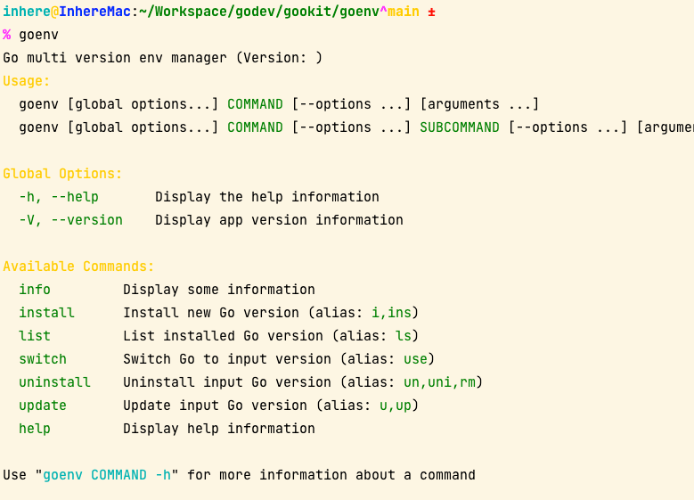
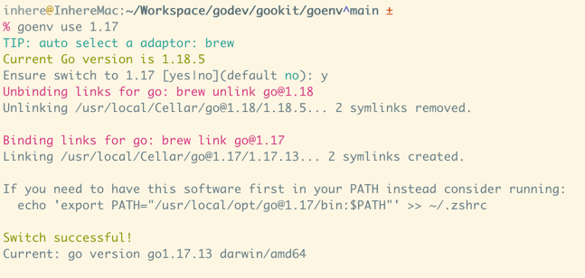

# GoEnv


[](https://github.com/inherelab/goenv/actions/workflows/go.yml)
[](https://github.com/inherelab/goenv)
[](https://pkg.go.dev/github.com/inherelab/goenv)
[](https://goreportcard.com/report/github.com/inherelab/goenv)

Go multi version env manager

- features TODO



> **[中文说明](README.zh-CN.md)**

## Install

**Curl install**

```shell
curl https://github.com/inherelab/goenv/releases/latest/download/goenv-linux-amd64 -L -o /usr/local/bin/goenv
chmod a+x /usr/local/bin/goenv
```

> TIPs: notice replace the OS and arch on `goenv-linux-amd64`

**Use go install**

```shell
go install github.com/inherelab/goenv/cmd/goenv
```

## Usage

Run goenv for see available commands

```shell
goenv
```

### Switch

Switch Go to another version

```shell
goenv switch 1.16
```
Or:

```shell
goenv use 1.16
```

**preview**(on MacOS)



### Install

Install new version

```shell
goenv install 1.18
```

### Update

```shell
goenv update 1.18
```

### Uninstall

```shell
goenv uninstall 1.18
```

### Info

```shell
goenv info
```

### List

```shell
goenv list
# or
goenv ls
```

## Development

### Clone

```shell
go clone https://github.com/inherelab/goenv
cd goenv
```

### Run

```bash
go run ./cmd/goenv
```

### Install

```bash
go install ./cmd/goenv
```

## Base on

- https://github.com/gookit/color
- https://github.com/gookit/config
- https://github.com/gookit/gcli
- https://github.com/gookit/goutil

## LICENSE

[MIT](LICENSE)
